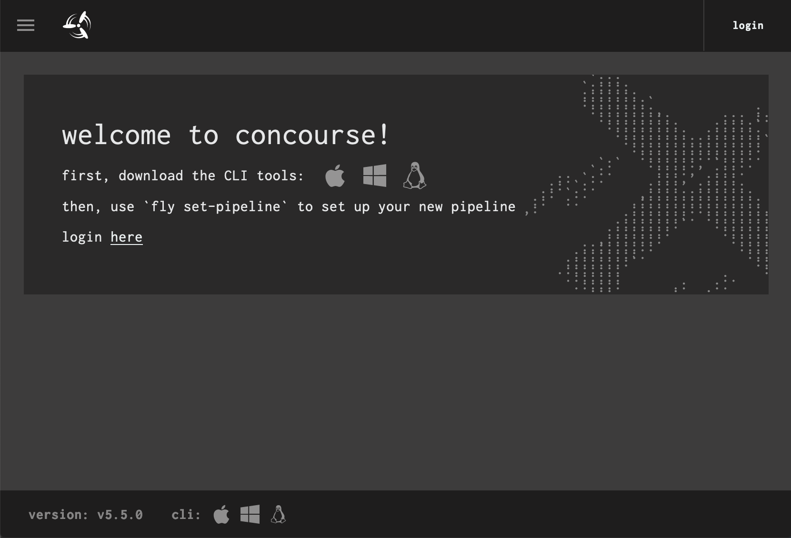
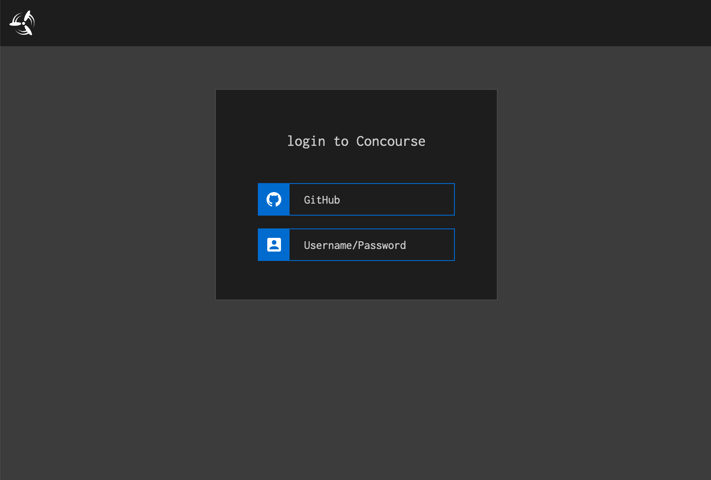
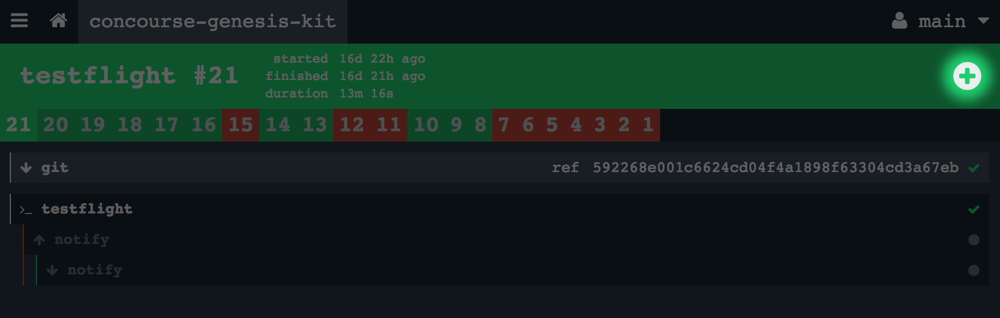
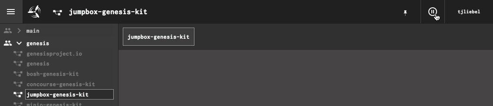
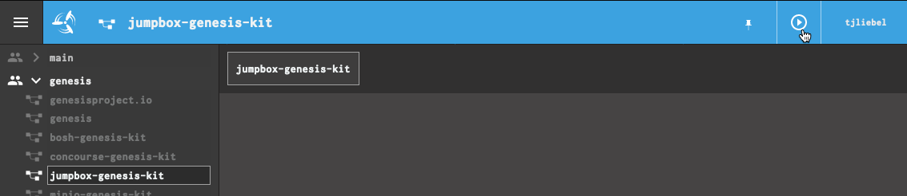
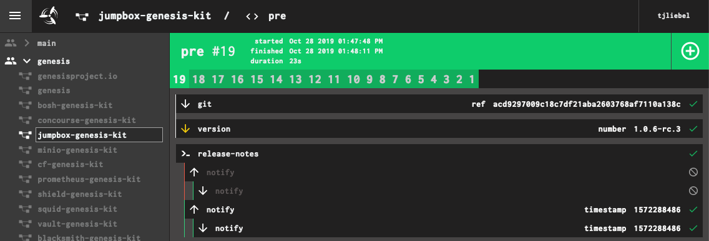

## Find Your Concourse Installation

The `genesis info` command will get the general information that you
need.

```
$ genesis info my-env

================================================================================

CONCOURSE Deployment for Environment 'my-env'

  Last deployed more than a month ago (06:52PM on Oct 14, 2019 UTC)
             by you
        to BOSH my-env
   based on kit concourse/3.7.0
          using Genesis v2.6.16
  with manifest .genesis/manifests/my-env.yml (redacted)

--------------------------------------------------------------------------------

Web Client
  URL:      https://10.128.80.32
  username: concourse
  password: ...

================================================================================
```

If you have a need to see the find all the IPs in your concourse
deployment, use bosh directly to do that. 

```
$ bosh -e my-env -d my-env-concourse vms
Using environment 'https://10.128.80.0:25555' as user 'admin'

Task 1416. Done

Deployment 'my-env-concourse'

Instance                                      Process State  AZ  IPs           VM CID                                   VM Type           Active
db/537db50b-e548-4af2-b799-7c2d5d2b38aa       running        z1  10.128.80.37  vm-d0402cb0-2a6f-4c60-a400-a0aabc20d2fe  small             true
haproxy/8cc09e62-9ac2-44cc-8594-acca42113895  running        z1  10.128.80.32  vm-b7e74ce1-50d5-4a03-9001-0b14880970c8  small             true
web/1543f581-167b-4791-b044-ce7eea0dd3fe      running        z1  10.128.80.33  vm-876eaf63-ad86-4789-87d5-93aaae99f6ec  small             true
worker/6dcc7c21-c976-41fd-ad5a-9c86b63a95fb   running        z1  10.128.80.35  vm-13346811-d7f0-41af-b963-4dc0bd9c2752  concourse-worker  true
worker/a2d8882c-f649-4318-880d-e29612489a6c   running        z1  10.128.80.34  vm-71a21afa-8773-4e5a-b93c-9ff86b5b03d3  concourse-worker  true
worker/e4d3d23b-469c-40a0-ad16-a99fa7a8e092   running        z1  10.128.80.36  vm-3b3509f3-0567-4246-8f5b-6d52105fcc51  concourse-worker  true

6 vms

Succeeded
```

The `haproxy` instance IP matches the Web Client URL in the `genesis info` 
output above because `haproxy` is the one terminating inbound API access.
If specified, the Web Client URL will be the external domain. 

There are a number of helpful Genesis addons as well: 
```
$ genesis do my-env list

Running list addon for my-env
The following addons are defined:

  visit                Open the Concourse Web User Interface in your browser
                       (requires macOS)

  download-fly         Get the version of fly compatible with this Concourse

  login                Login to this Concourse deployment with fly

  logout               Logout of this Concourse deployment with fly

  fly                  Run fly commands targetting this Concourse Deployment

  setup-approle        Create the necessary Vault AppRole and policy for Genesis
                       Concourse deployments.
```


## Install `fly`, The Concourse CLI

Quickest way is with the genesis addon `download-fly`.

```
genesis do my-env download-fly
Running download-fly addon for my-env

Downloading darwin/amd64 version of fly from https://10.128.80.32...

  % Total    % Received % Xferd  Average Speed   Time    Time     Time  Current
                                 Dload  Upload   Total   Spent    Left  Speed
100 20.2M  100 20.2M    0     0  18.6M      0  0:00:01  0:00:01 --:--:-- 18.6M

Download successful - written to ./fly
```

As you upgrade Concourse, you will also need to update your local
copy of `fly`.  Assuming you have logged into Concourse, you can
easily update by running `download-fly` again. 


## Log Into Concourse

To log in from the _command-line_, you'll need to have `fly`
installed. Then you can use the `login` addon. 

```
$ genesis do my-env login
Running login addon for my-env

Logging in to Concourse deployment my-env as user 'concourse'.

logging in to team 'main'


target saved
```

You can use this addon when your token expires as well.

```
$ fly targets
name             url                              team   expiry
my-env           https://10.128.80.32             main   n/a: Token is expired

$ genesis do my-env login
Running login addon for my-env

Logging in to Concourse deployment my-env as user 'concourse'.

logging in to team 'main'


target saved

$ fly targets
name             url                              team   expiry
my-env           https://10.128.80.32             main   Sat, 23 Nov 2019 19:48:30 UTC
```

You can use `fly` directly using the `-t my-env` option to specify the target 
deployment, or use `genesis do my-env fly` to execute fly commands and genesis 
will specify which deployment to target.

```
$ fly -t my-env status
logged in successfully

$ genesis do my-env fly status
Running fly addon for my-env

Running fly against my-env

logged in successfully
```

Similarly, there is a `logout` addon as well. 

```
$ genesis do my-env logout
Running logout addon for my-env

logged out of target: my-env
```

If you are on the same machine as your browser instance (not on a jumpbox), 
you can use the `visit` command to get to the web UI. Or you can reach it 
directly via the Web Client URL from `info`.

```
genesis do my-env visit
Running visit addon for my-env

You will need to enter the following credentials once the page opens:
  username: concourse
  password: ...

Press any key to open the web console...
```



 
Select login. For Github authentication, click the _login with Github_
button.



The first time you do this, you will need to authorize the Github
endpoint to access your account information.  On subsequent
authentication attempts, it should be seamless.


## Login to Concourse Without Genesis

If you are trying to access concourse on a machine without Genesis, or 
give someone access to Concourse without giving them access to Genesis
 

First thing is to install `fly`. Easiest way to get the correct version 
of `fly` is from the Apple, Windows, or Linux buttons in the concourse UI. 
They can be found on the bottom bar of most concourse screens (usually
towards the right). They can also be found on the welcome screen prior 
to login. 


First, tell `fly` where your Concourse is:

```
$ fly -t my-env login -c https://$IP -k
logging in to team 'main'

navigate to the following URL in your browser:

    https://$IP/auth/github?team_name=main&fly_local_port=$SOME_PORT

or enter token manually:
```

If you are executing `fly` from the same machine that runs your
browser instance, you can just visit the link and the Concourse
server will communicate to the `fly` process through the browser.

If you are running `fly` on a jumpbox or bastion host, the port
connection won't be properly wired up (your browser can't
communicate with the jumpbox instance of `fly`).  You can either
omit the trailing `&fly_local_port=...` on the URL you put in the
browser, or leave it and let it fail.  In either case, the browser
will display a bearer token that looks like this:

```
Bearer
eyJhbGciOiJSUzI1NiIsInR5cCI6IkpXVCJ9.eyJjc3JmIjoiZjhkZTEzYzUxMTAzYWYyNTMzN
WE3MGE3ZGQwNzdlYzUxMGQxMzA2ZjlhNGZkZGZmNzAwOGEwMzU4YzQwYzAwOSIsImV4cCI6MTU
yMjE3MDU1OCwiaXNBZG1pbiI6dHJ1ZSwidGVhbU5hbWUiOiJtYWluIn0.cbhjKKzDr7V0UjpuA
F0yrpr7VFdc7baKH8gJ1w5WaLYpy0oeUjdgMPbM9Th04OsOWMKxAi6yQcHDj6mWDlKNaqjJrkn
yMjE3MDU1OCwiaXNBZG1pbiI6dHJ1ZSwidGVhbU5hbWUiOiJtYWluIn0.cbhjKKzDr7V0UjpuA
F0yrpr7VFdc7baKH8gJ1w5WaLYpy0oeUjdgMPbM9Th04OsOWMKxAi6yQcHDj6mWDlKNaqjJrkn
4lqHk3NcudKUW-qxJatQf49iIDcIyJK4isX2qRiQMYGXEY44m3etbDd2VGoLMDsNNrUE-JHL73
OS42qZJAD-hNz2jl8zxPek8md-oRA
```

(newlines added for clarity)

You must copy the _entire string_, including the "Bearer " prefix,
into the waiting prompt in terminal.

Use `fly targets` to verify:

```
$ fly targets
name             url                              team   expiry
my-env           https://10.128.80.32             main   Sat, 23 Nov 2019 19:48:30 UTC
```

From now on, all of your `fly` commands will need the `-t my-env`
option, to target correctly.


## View Your Pipelines

From a browser, the list of pipelines is accessed via the
three-bar icon in the top-left corner of the interface, which
shows the sidebar.


Clicking on a pipeline in the sidebar brings up the main page,
which has all of the inputs, outputs, and jobs that comprise the
workflow.

From the terminal (assuming you have installed `fly` and are
logged in), you can run:

```
$ genesis do my-env fly pipelines
name                    paused  public
blacksmith-genesis-kit  no      no
bosh-genesis-kit        no      no
concourse-genesis-kit   no      no
jumpbox-genesis-kit     no      no
shield-genesis-kit      no      no
squid-genesis-kit       no      no
vault-genesis-kit       no      no
shieldproject.io        no      no
prometheus-genesis-kit  no      no
... etc ...
```

You can list the jobs on a single pipeline as well:

```
$ genesis do my-env fly jobs -p concourse-genesis-kit
name        paused  status     next
testflight  no      succeeded  n/a
rc          no      succeeded  n/a
minor       no      succeeded  n/a
major       no      n/a        n/a
shipit      no      succeeded  n/a
```

Jobs that have never run have a status of `n/a`.


## List Workers

NOTE: This task requires that `fly` is installed and that you are
logged in.

To list off all of the workers that have registered with your
Concourse TSA, and their health, use `fly workers`:

```
$ genesis do my-env fly workers
name                                  containers  platform  tags  team  state    version
7cfecc9b-e0cd-4f8d-b771-6c26b8782de3  6           linux     none  none  running  1.2
ac17d59e-e92e-4304-a09e-9a5356996296  19          linux     none  none  running  1.2
e52c1b40-1171-464e-89ac-07c60cb09d5d  17          linux     none  none  running  1.2
```

In sequestered network environments, you will have one contingent
of workers for each separate network environment.  Those workers
will have _tags_ defined that help to partition the overall
concourse into _zones_ for purposes of deployment scheduling.


## Trigger Pipeline Jobs

From the browser, you can select a job and click on the big `+` icon on any job to
force it to run right now:



From the command-line, you can use `fly` (assuming it is installed
and you are already logged in).

First, find the pipeline, and inspect its jobs:

```
$ genesis do my-env fly pipelines
$ genesis do my-env fly jobs -p my-pipeline
```

Then, trigger the pipeline/job:

```
$ genesis do my-env fly trigger -j my-pipeline/my-job
```


## Pause and Unpause Pipelines

If you pause a pipeline, it will not execute, even if one of its
inputs triggers it to.  This can be useful if you want to make
sure Concourse isn't building software or doing deployments in a
chagne blackout window.

You can pause a pipeline from the web UI by clicking on the
&#x23f8; icon in the top right next to your user:



To unpause, click the &#x25b6; icon in the same location. Paused
pipelines show up with a blue header in the web UI:



To pause a pipeline from the command-line, you will need to
install `fly` and make sure you are logged in.

```
$ genesis do my-env fly pause-pipeline -p my-pipeline
```

To unpause:

```
$ genesis do my-env fly unpause-pipeline -p my-pipeline
```

Note: Genesis always unpauses its pipelines after you repipe them.


## Access Check and Task Containers

Concourse has a feature called _hijacking_ or (more politically
correct) _intercepting_, by which an operator can gain a remote
shell on a check or task container and poke around.

This is handy for troubleshooting failing pipelines, but the
execution is hit or miss.  Concourse tends to only keep failed
containers around for a brief period of time, to facilitate
debugging.  Successful containers are destroyed immediately.

Start by finding the job you are interested in:

```
$ genesis do my-env fly pipelines
$ genesis do my-env fly jobs -p m-pipeline
```

Then, specify the pipeline/job in a call to `fly hijack`:

```
$ genesis do my-env fly hijack -j my-pipeline/testflight
1: build #51, step: git, type: get
2: build #51, step: notify, type: get
3: build #51, step: notify, type: put
4: build #51, step: testflight, type: task
choose a container: 4

root@66d6cd55-345a-4078-7c5e-365c4e650c81:/tmp/build/778af108# ls /
bin  boot  dev  etc  home  lib  lib64  media  mnt  opt  proc  root  run  sbin  scratch  srv  sys  tmp  usr  var

root@66d6cd55-345a-4078-7c5e-365c4e650c81:/tmp/build/778af108# exit
```

You will note that containers in Concourse are often very bare and stripped
down.  For example, in the above container, there is no `ping` utility.


## Fix Broken Workers

A common cause of "drive-by" failures in CI is a misbehaving worker, often
caused by an out-of-disk scenario.  In these cases, the easiest recourse is
to forcibly recreate the workers via BOSH.

Workers have no persistent state.  All of the interesting bits of Concourse
are stored in the database node, which does have a persistent disk attached.
Deleting and rebuilding workers has no lasting ill effects on a Concourse
installation, although it does temporarily reduce capacity.  Of course, if
your workers are unable to perform, you are already at reduced capacity.

To recreate workers:

```
$ bosh -e your-env -d your-env-concourse recreate worker
```

This will redeploy just the `worker` instance group, assuming the rest of
the Concourse deployment is healthy.

If you operate in a distributed infrastructure with sequestered networks
served by workers-only deployments, you will need to target the appropriate
environment BOSH director and worker deployment, but the command is
otherwise identical.


## Determine What Triggered a Job

It can be helpful to know what input triggered a given job to run in a
pipeline, especially with deployment pipelines that seem to run for no
apparent reason.

Concourse does give you a visual cue, but you have to know to look for it,
and what it is.  Any input that triggers a job will have a yellow/gold down
arrow as opposed to a white down arrow. 



Here, even though we have two inputs to this job, it was the `git` resource that triggered the `rc` job, not the `version`.

And now you know.


## View Pipeline Configurations

Concourse has a complete manifest that it uses to run your
pipeline.  You can use `fly` to retrieve this manifest.

```
$ genesis do my-env fly get-pipeline -p name-of-pipeline
```

This will dump a (probably very large) YAML document, to standard
output.  This YAML document describes the pipeline, in whole.

## Configure a Pipeline

To create a new pipeline, assuming you have already written the
YAML definition file (the "manifest"), all you need to do is:

```
$ genesis do my-env fly set-pipeline -p name-of-pipeline path/to/def.yml
```

Note: for Genesis deployments, you should refer to the Genesis
runbooks, since `genesis` actually manages the pipeline
definition, and has first-class support for configuring Concourse
on your behalf.
