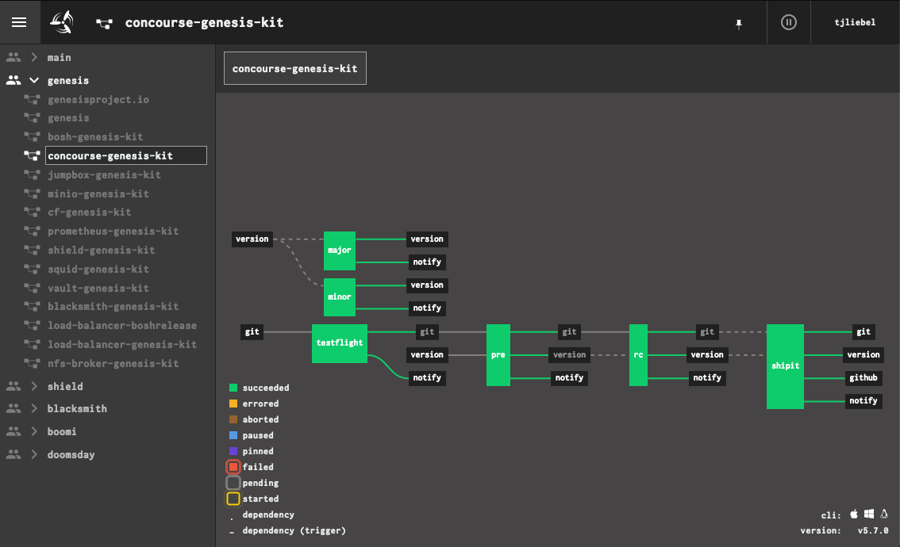
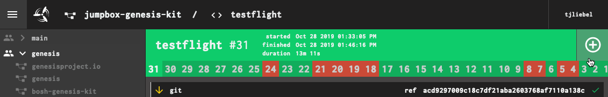

## Find Your Concourse Installation

The easiest way to find out the IP address of your Concourse is to
interrogate BOSH for the deployment VM IPs:

```
$ bosh -d your-concourse vms
Using environment 'https://10.0.0.4' as client 'admin'

Task 5929. Done

Deployment 'your-concourse'

Instance                                      Process State  AZ  IPs        VM CID                                   VM Type
db/99da7876-bbb6-45ba-a3f2-c47773bbaa8d       running        z1  10.0.2.0   vm-29139deb-7f04-4829-ade9-5cc650ea6557  small
haproxy/257059b8-f995-4725-b494-32d22adf0fcc  running        z1  10.0.2.2   vm-c0afb5b1-1972-4135-98de-1912d4285a92  small
web/207ce2a1-65d0-4988-b62e-f7246190cdd5      running        z1  10.0.2.3   vm-73caf2a9-aac3-4635-b3e7-3fa628af415d  small
worker/7cfecc9b-d9ab-4659-8356-84ab331e2bb4   running        z1  10.0.2.1   vm-9965eb20-c6f6-4f16-ad7c-359645b8f598  runtime
worker/ac17d59e-d03d-43a6-be86-4258c91d146c   running        z1  10.0.2.11  vm-55badb90-26d2-4d51-8ccb-0b74d25c1cfb  runtime
worker/e52c1b40-d893-4828-83d5-20a575a66acd   running        z1  10.0.2.12  vm-a63c96fd-311f-4896-90ca-58c153d72c38  runtime

6 vms

Succeeded
```

The `haproxy` instance is the one terminating inbound API access,
so that's the IP we care about.


## Log Into Concourse

To log into concourse from _the browser_, simply open up the web
UI (either by name, if you have DNS hooked up to the Concourse
haproxy instance, or by IP).


Then, select your Concourse team:


(you probably only have a `main` team).

For Github authentication, click the _login with Github_ button.


The first time you do this, you will need to authorize the Github
endpoint to access your account information.  On subsequent
authentication attempts, it should be seamless.

To log in from the _command-line_, you'll need to have `fly`
installed.

First, tell `fly` where your Concourse is:

```
$ fly -t my-ci login -c https://$IP -k
logging in to team 'main'

navigate to the following URL in your browser:

    https://$IP/auth/github?team_name=main&fly_local_port=$SOME_PORT

or enter token manually:
```

If you are executing `fly` from the same machine that runs your
browser instance, you can just visit the link and the Concourse
server will communicate to the `fly` process through the browser.

If you are running `fly` on a jumpbox or bastion host, the port
connection won't be properly wired up (your browser can't
communicate with the jumpbox instance of `fly`).  You can either
omit the trailing `&fly_local_port=...` on the URL you put in the
browser, or leave it and let it fail.  In either case, the browser
will display a bearer token that looks like this:

```
Bearer
eyJhbGciOiJSUzI1NiIsInR5cCI6IkpXVCJ9.eyJjc3JmIjoiZjhkZTEzYzUxMTAzYWYyNTMzN
WE3MGE3ZGQwNzdlYzUxMGQxMzA2ZjlhNGZkZGZmNzAwOGEwMzU4YzQwYzAwOSIsImV4cCI6MTU
yMjE3MDU1OCwiaXNBZG1pbiI6dHJ1ZSwidGVhbU5hbWUiOiJtYWluIn0.cbhjKKzDr7V0UjpuA
F0yrpr7VFdc7baKH8gJ1w5WaLYpy0oeUjdgMPbM9Th04OsOWMKxAi6yQcHDj6mWDlKNaqjJrkn
yMjE3MDU1OCwiaXNBZG1pbiI6dHJ1ZSwidGVhbU5hbWUiOiJtYWluIn0.cbhjKKzDr7V0UjpuA
F0yrpr7VFdc7baKH8gJ1w5WaLYpy0oeUjdgMPbM9Th04OsOWMKxAi6yQcHDj6mWDlKNaqjJrkn
4lqHk3NcudKUW-qxJatQf49iIDcIyJK4isX2qRiQMYGXEY44m3etbDd2VGoLMDsNNrUE-JHL73
OS42qZJAD-hNz2jl8zxPek8md-oRA
```

(newlines added for clarity)

You must copy the _entire string_, including the "Bearer " prefix,
into the waiting prompt in terminal.

Use `fly targets` to verify:

```
fly targets
name   url             team  expiry
my-ci  https://.../?   main  Tue, 19 Dec 2017 17:09:18 UTC
```

Your real IP / domain name shoud show up in the output.

From now on, all of your `fly` commands will need the `-t my-ci`
option, to target correctly.


## Install `fly`, The Concourse CLI

If you have access to a browser, you can visit the Concourse URL
and download the correct `fly` binary for your platform, by
clicking on one of the icons on the main page:


For Linux jumpbox and bastion hosts, you can also use `curl` to
download the Linux binary directly:

```
$ curl -Lo ~/bin/fly \
       'https://$IP/api/v1/cli?arch=amd64&platform=linux'
$ chmod 0755 ~/bin/fly
```

The quotes on the URL are important, to keep your shell from
backgrounding the first part (up to the `&`) of the command.

This also assumes you have a `~/bin` folder (you should) and that
it is in your `$PATH` (it should be).  If necessary, add this to
your `~/.bashrc`:

```
export PATH=$PATH:~/bin
```

You can verify that `fly` is working by running `fly -h`.

As you upgrade Concourse, you will also need to update your local
copy of `fly`.  Assuming you have logged into Concourse, you can
easily update by running:

```
$ fly -t my-ci sync
```

This will contact the targeted Concourse (`my-ci`), download a new
`fly` binary, and overwrite your locally-installed copy.


## View Your Pipelines

From a browser, the list of pipelines is accessed via the
three-bar icon in the top-left corner of the interface, which
shows the sidebar.



Clicking on a pipeline in the sidebar brings up the main page,
which has all of the inputs, outputs, and jobs that comprise the
workflow.

From the terminal (assuming you have installed `fly` and are
logged in), you can run:

```
$ fly -t my-ci pipelines
name                    paused  public
blacksmith-genesis-kit  no      no
bosh-genesis-kit        no      no
concourse-genesis-kit   no      no
jumpbox-genesis-kit     no      no
shield-genesis-kit      no      no
squid-genesis-kit       no      no
vault-genesis-kit       no      no
shieldproject.io        no      no
prometheus-genesis-kit  no      no
... etc ...
```

You can list the jobs on a single pipeline as well:

```
$ fly -t my-ci jobs -p concourse-genesis-kit
name        paused  status     next
testflight  no      succeeded  n/a
rc          no      succeeded  n/a
minor       no      succeeded  n/a
major       no      n/a        n/a
shipit      no      succeeded  n/a
```

Jobs that have never run have a status of `n/a`.


## List Workers

NOTE: This task requires that `fly` is installed and that you are
logged in.

To list off all of the workers that have registered with your
Concourse TSA, and their health, use `fly workers`:

```
$ fly -t my-ci workers
name                                  containers  platform  tags  team  state    version
7cfecc9b-e0cd-4f8d-b771-6c26b8782de3  6           linux     none  none  running  1.2
ac17d59e-e92e-4304-a09e-9a5356996296  19          linux     none  none  running  1.2
e52c1b40-1171-464e-89ac-07c60cb09d5d  17          linux     none  none  running  1.2
```

In sequestered network environments, you will have one contingent
of workers for each separate network environment.  Those workers
will have _tags_ defined that help to partition the overall
concourse into _zones_ for purposes of deployment scheduling.


## Trigger Pipeline Jobs

From the browser, you can click on the big `+` icon on any job to
force it to run right now:



From the command-line, you can use `fly` (assuming it is installed
and you are already logged in).

First, find the pipeline, and inspect its jobs:

```
$ fly -t my-ci pipelines
$ fly -t my-ci jobs -p my-pipeline
```

Then, trigger the pipeline/job:

```
$ fly -t my-ci trigger -j my-pipeline/my-job
```


## Pause and Unpause Pipelines

If you pause a pipeline, it will not execute, even if one of its
inputs triggers it to.  This can be useful if you want to make
sure Concourse isn't building software or doing deployments in a
chagne blackout window.

You can pause a pipeline from the web UI by clicking on the
&#x23f8; icon next to the pipeline name in the sidebar.  Paused
pipelines show up with a blue header in the web UI:


To unpause, click the &#x25b6; icon in the sidebar.

To pause a pipeline from the command-line, you will need to
install `fly` and make sure you are logged in.

```
$ fly -t my-ci pause-pipeline -p my-pipeline
```

To unpause:

```
$ fly -t my-ci unpause-pipeline -p my-pipeline
```

Note: Genesis always unpauses its pipelines after you repipe them.


## Access Check and Task Containers

Concourse has a feature called _hijacking_ or (more politically
correct) _intercepting_, by which an operator can gain a remote
shell on a check or task container and poke around.

This is handy for troubleshooting failing pipelines, but the
execution is hit or miss.  Concourse tends to only keep failed
containers around for a brief period of time, to facilitate
debugging.  Successful containers are destroyed immediately.

Start by finding the job you are interested in:

```
$ fly -t my-ci pipelines
$ fly -t my-ci jobs -p m-pipeline
```

Then, specify the pipeline/job in a call to `fly hijack`:

```
$ fly -t my-ci hijack -j my-pipeline/testflight
1: build #51, step: git, type: get
2: build #51, step: notify, type: get
3: build #51, step: notify, type: put
4: build #51, step: testflight, type: task
choose a container: 4

root@66d6cd55-345a-4078-7c5e-365c4e650c81:/tmp/build/778af108# ls /
bin  boot  dev  etc  home  lib  lib64  media  mnt  opt  proc  root  run  sbin  scratch  srv  sys  tmp  usr  var

root@66d6cd55-345a-4078-7c5e-365c4e650c81:/tmp/build/778af108# exit
```

You will note that containers in Concourse are often very bare and stripped
down.  For example, in the above container, there is no `ping` utility.


## Fix Broken Workers

A common cause of "drive-by" failures in CI is a misbehaving worker, often
caused by an out-of-disk scenario.  In these cases, the easiest recourse is
to forcibly recreate the workers via BOSH.

Workers have no persistent state.  All of the interesting bits of Concourse
are stored in the database node, which does have a persistent disk attached.
Deleting and rebuilding workers has no lasting ill effects on a Concourse
installation, although it does temporarily reduce capacity.  Of course, if
your workers are unable to perform, you are already at reduced capacity.

To recreate workers:

```
$ bosh -e your-env -d your-env-concourse recreate worker
```

This will redeploy just the `worker` instance group, assuming the rest of
the Concourse deployment is healthy.

If you operate in a distributed infrastructure with sequestered networks
served by workers-only deployments, you will need to target the appropriate
environment BOSH director and worker deployment, but the command is
otherwise identical.


## Determine What Triggered a Job

It can be helpful to know what input triggered a given job to run in a
pipeline, especially with deployment pipelines that seem to run for no
apparent reason.

Concourse does give you a visual cue, but you have to know to look for it,
and what it is.  Any input that triggers a job will have a lighter
background than the others.  It's subtle, but useful.


Here, even though we have two inputs to this job, it was the `git` resource that triggered the `rc` job, not the `version`.

And now you know.


## View Pipeline Configurations

Concourse has a complete manifest that it uses to run your
pipeline.  You can use `fly` to retrieve this manifest.

```
$ fly -t ci get-pipeline -p name-of-pipeline
```

This will dump a (probably very large) YAML document, to standard
output.  This YAML document describes the pipeline, in whole.

## Configure a Pipeline

To create a new pipeline, assuming you have already written the
YAML definition file (the "manifest"), all you need to do is:

```
$ fly -t ci set-pipeline -p name-of-pipeline path/to/def.yml
```

Note: for Genesis deployments, you should refer to the Genesis
runbooks, since `genesis` actually manages the pipeline
definition, and has first-class support for configuring Concourse
on your behalf.
