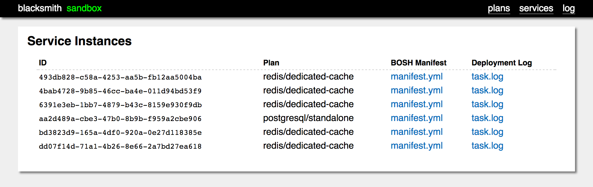

On-demand and shared services are provided by Blacksmith.
Blacksmith is a service broker for Cloud Foundry that uses a
dedicated BOSH director to deploy actual VMs in response to
service provisioning requests.  If a CF user wants a PostgreSQL
box all to themselves, Blacksmith will do so.

The _magic_ of Blacksmith is accomplished by way of _Forges_,
small bits of configuration, packaged up as a BOSH release, that
can be added into a Blacksmith deployment.

The Blacksmith Genesis Kit packages five forges at the moment:

  1. [Redis][redis-forge]
  2. [RabbitMQ][rabbitmq-forge]
  3. [PostgreSQL][postgresql-forge]
  4. [MariaDB][mariadb-forge]
  5. [Kubernetes][kubernetes-forge]

Refer to their specific project pages for more details information
on their features and configuration.

The [Blacksmith Kit documentation][blacksmith-kit] explains how to
configure each of these Forges and their service offerings.

[redis-forge]:      https://github.com/blacksmith-community/redis-forge-boshrelease
[rabbitmq-forge]:   https://github.com/blacksmith-community/rabbitmq-forge-boshrelease
[postgresql-forge]: https://github.com/blacksmith-community/postgresql-forge-boshrelease
[mariadb-forge]: https://github.com/blacksmith-community/mariadb-forge-boshrelease
[kubernetes-forge]: https://github.com/blacksmith-community/kubernetes-forge-boshrelease

[blacksmith-kit]: https://github.com/genesis-community/blacksmith-genesis-kit

## Get information about your Blacksmith

If deployed with Genesis, `genesis info my-env` will dump most of the relevant 
information for the deployment.

```
genesis info my-env

================================================================================

BLACKSMITH Deployment for Environment 'my-env'

  Last deployed about a week and a half ago (10:04PM on Oct 25, 2019 UTC)
             by admin
        to BOSH my-env
   based on kit blacksmith/0.5.0
          using Genesis v2.6.16
  with manifest .genesis/manifests/my-env.yml (redacted)

--------------------------------------------------------------------------------

ca certificate
 ...


bosh env
  Using environment 'https://10.128.80.129:25555' as client 'admin'

  Name               my-env-blacksmith
  UUID               e33feb30-0e9d-4461-906e-18239abba00c
  Version            270.2.0 (00000000)
  Director Stemcell  ubuntu-xenial/315.36
  CPI                vsphere_cpi
  Features           compiled_package_cache: disabled
                     config_server: disabled
                     local_dns: enabled
                     power_dns: disabled
                     snapshots: disabled
  User               admin

  Succeeded


blacksmith (internal) bosh director
  bosh url: https://10.128.80.129:25555
  username: admin
  password: ...


blacksmith web management UI
  web url:   http://10.128.80.129:3000
  username:  blacksmith
  password:  ...
  clickable: ...


blacksmith catalog
  Service     Plans          Tags
  =======     =====          ====
  mariadb     standalone     blacksmith
                             dedicated
                             mariadb

  postgresql  small-cluster  blacksmith
              standalone     dedicated
                             postgresql

  rabbitmq    small-cluster  blacksmith
              standalone     dedicated
                             rabbitmq

  redis       standalone     blacksmith
                             dedicated
                             redis


================================================================================
```

## Determine the IP address of your Blacksmith Broker

You can get this from BOSH itself (or from `genesis my-env info`):

```
$ bosh -e my-env -d my-env-blacksmith vms
Using environment 'https://10.128.80.0:25555' as user 'admin'

Task 1297. Done

Deployment 'my-env-blacksmith'

Instance                                         Process State  AZ  IPs            VM CID                                   VM Type     Active
blacksmith/e195326f-ddf2-4304-b84e-503b8da3e2f2  running        z1  10.128.80.129  vm-fe96913b-4710-4dad-b079-39d81f4dfed9  blacksmith  true

1 vms

Succeeded
```

Blacksmith runs on port `3000` by default, so the URL of this
particular Blacksmith is `http://10.128.80.129:3000`.


## Register a Blacksmith Broker

Before your Cloud Foundry users can start provisioning services
via your new Blacksmith, it has to be registered with Cloud
Foundry, and enabled in the CF marketplace.

If deployed with Genesis, the `register` addon makes this easy. 

```
$ genesis do my-env.yml register
Running register addon for my-env
authenticating to https://api.system.10.128.80.140.netip.cc as admin...
Setting api endpoint to https://api.system.10.128.80.140.netip.cc...
OK

api endpoint:   https://api.system.10.128.80.140.netip.cc
api version:    2.138.0
Not logged in. Use 'cf login' to log in.
API endpoint: https://api.system.10.128.80.140.netip.cc
Authenticating...
OK

Use 'cf target' to view or set your target org and space.
creating service broker my-env-blacksmith...
Creating service broker my-env-blacksmith as admin...
OK

enabling service access...
 ...
```

If not deployed with Genesis or to register the broker manually, you'll need its IP address (see
_Determining the IP address of your Blacksmith Broker_).

```
$ cf create-service-broker \
     your-env-name-blacksmith \
     blacksmith \
     $(safe read secret/your/env/name/blacksmith/broker:password)
     http://$IP:3000
```

The first argument is the name of your broker.  If you have
multiple Blacksmith brokers, you will want to choose appropriate
names to distinguish them.

The second argument is the HTTP username for accessing the broker
API.  This is always `blacksmith`.

The third argument is the password for the HTTP `blacksmith` user.
This is stored in the Vault, and the `$(safe ...)` call in the
listing will extract it for you.

The final argument is the URL of the broker API, which depends on
the IP of the broker.  The port is always 3000.

You can verify that the broker is registered, by checking that it
is listed in the output of `cf service-brokers`

For more details, refer to [Managing Service Brokers][cf-csb], in
the official Cloud Foundry documentation.

Next, you'll need to enable access to the Blacksmith broker's
services and plans, so that Cloud Foundry users will see them in
the marketplace:

```
$ cf enable-service-access your-env-name-blacksmith
```

This makes all the plans and services owned by the
`your-env-name-blacksmith` broker available to all orgs and spaces
in your Cloud Foundry instance.  If you need stricter permissions,
check the [Marketplace Access Control][cf-esa] section of the
official Cloud Foundry documentation.

You can verify the publication of your Blacksmith broker's plans
by running `cf marketplace` and checking that you see the plans
you defined in your Blacksmith manifests.

[cf-csb]: https://docs.cloudfoundry.org/services/managing-service-brokers.html
[cf-esa]: https://docs.cloudfoundry.org/services/access-control.html#enable-access


## Access the Blacksmith Management UI

The Blacksmith Management Web UI provides an overview of what is
going on with a single Blacksmith Services Broker.

If deployed with Genesis, it is as easy as:

```
$ genesis do my-env visit
Running visit addon for my-env
```

To access it without Genesis, you'll you'll need its IP address (see
_Determining the IP address of your Blacksmith Broker_).

All of Blacksmith is protected by HTTP basic authentication.  The
username is always `blacksmith`, and the password can be found in
your Vault:

```
$ safe read secret/$ENV/blacksmith/broker:password
```

(replacing `$ENV` with your actually environment prefix, something
 like `us/east/2/prod` for `us-east-2-prod`).

The UI lists the current catalog:


It also lists all deployed instances:



Finally, the last 8,000 (or so) log lines are buffered and printed
to the _Log_ section:


## Install `eden`

[eden][eden] is a command-line utility for interacting with Open
Service Broker API implementations.  All Cloud Foundry service
brokers conform to OSB, so `eden` works with Blacksmith.

On Mac OS, if you use [Homebrew][brew], you can `brew install
eden` and you're done.

On Ubuntu Linux, you can add the [Stark & Wayne APT
repository][apt] and just `apt install eden`.

On all other platforms, you can check out the [Eden Github
Releases page][eden-releases] to see if there is a pre-built
binary for you.


[eden]:          https://github.com/starkandwayne/eden
[eden-releases]: https://github.com/starkandwayne/eden/releases
[brew]:          https://brew.sh
[apt]:           http://apt.starkandwayne.com


## Configure `eden` To Work With Your Blacksmith

The `eden` utility needs to know the URL of the Blacksmith broker,
as well as the username and password for accessing it.  These
should be set in the `SB_BROKER_*` environment variables:

```
$ export SB_BROKER_URL=http://$IP:3000
$ export SB_BROKER_USERNAME=blacksmith
$ export SB_BROKER_PASSWORD=$(safe read secret/your/env/name/blacksmith/broker:password)
```

You can verify that your local environment is properly configured
by querying the Blacksmith service catalog:

```
$ eden catalog
```

Note: this will be a subset of your actual CF marketplace.
Otherwise, details should match.


## Provision a Service via `cf`

Cloud Foundry users can create new services using the standard
process, with the `cf` command-line utility:

```
$ cf create-service dedicated-redis standalone my-kvstore
```

This will create a dedicated Redis instance, as a standalone,
single-VM deployment.  The name of the service (which is
arbitrary) will be `my-kvstore`.

Blacksmith is an asynchronous service broker, so the
`create-service` operation will return immediately, but the
service will be marked as _in progress_, until the Blacksmith BOSH
director has finished deploying it.  You can check on the progress
by issuing:

```
$ cf service my-kvstore
```

Once the service is created, it can be bound to an application:

```
$ cf bind-service key-value-app my-kvstore
```

The first argument is the application name (from a `cf push`), and
the second argument is the name we gave the service in our `cf
create-service` call.

For more in-depth review of Cloud Foundry services and
applications, check the [Service Overview][cf-svc] in the official
Cloud Foundry documentation.

[cf-svc]: https://docs.cloudfoundry.org/devguide/services/


## Remove a Service via `cf`

To remove a service, Cloud Foundry users should use the standard
`cf` command-line utility.

First, get a list of services provisioned in the current space:

```
$ cf services
```

If the service you want is bound to any applications, it will need
to be unbound before it can be deleted:

```
$ cf unbind-service app-name service-name
```

Then, it can be deleted:

```
$ cf delete-service service-name
```

Blacksmith is an asynchronous service broker, so the
`delete-service` operation will return immediately, but the
service will be marked as _in progress_, until the Blacksmith BOSH
director has finished deploying it.  You can check on the progress
by issuing:

```
$ cf service service-name
```

but be aware that once the operation succeeds, the service
information will be purged from the Cloud Foundry database, so `cf
service` will start failing because the service is unknown.

For more in-depth review of Cloud Foundry services and
applications, check the [Service Overview][cf-svc] in the official
Cloud Foundry documentation.

[cf-svc]: https://docs.cloudfoundry.org/devguide/services/


## Provision a Service via `eden` (as an Operator)

NOTE: This task requires that `eden` is installed, and properly
configured to work with your Blacksmith.

As an operator, you have the ability to bypass Cloud Foundry and
create service directly in Blacksmith.  This is a powerful
debugging and diagnostic tool, especially if you suspect that
Cloud Foundry is somehow responsible for some strange behavior.

**However**, use this technique sparingly.  Services provisioned
via `eden`, directly against the Blacksmith broker, will not show
up in `cf services`, and only the Blacksmith Management UI itself
will show you the instance IDs if you lose track of them.  Service
provisioned out-of-band will also use up quota allocations.

To provision a service, use `eden provision`

```
$ eden provision -s dedicated-redis -p standalone
```

Unlike the `cf` command-line utility, `eden` will regularly poll
the broker until the create operation either succeeds or fails.
In the event of failure, you should check the the Blacksmith
Management Web UI log (or the logs on the broker VM itself) for
details.

Once the operation succeeds, `eden` will tell you how to bind the
service to get at the credentials.  It will be something like:

```
$ eden bind -i <big-long-identifier-string>
```

## Remove a Service via `eden`

NOTE: This task requires that `eden` is installed, and properly
configured to work with your Blacksmith.

It is important to keep in mind that each operator has their own
local `eden` configuration.  This is where `eden` stores
information about services it has provisioned.  That means that if
someone on your team has used `eden` to provision a service, you
won't see that instance when you run `eden services` - you will
only see the services _you_ have provisioned.

It is also important to remember that `eden` has no way of knowing
what services _Cloud Foundry itself_ has provisioned.

Luckily, most of that doesn't matter, since `eden` does let you
deprovision a service by its instance ID.  You can get the
instance ID of a service from `cf service --guid my-service`, or
from the Blacksmith Management Web UI.

To delete a service directly:

```
$ eden deprovision -i <big-long-identifier-string>
```

`eden` will poll Blacksmith until the delete operation succeeds or
fails.  In the event of failure, you should check the the
Blacksmith Management Web UI log (or the logs on the broker VM
itself) for details.


## Clean Up Blacksmith via `eden`

NOTE: This task requires that `eden` is installed, and properly
configured to work with your Blacksmith.

Blacksmith currently fails to understand the responses from newer
BOSH directors (264.5+) to the _delete deployment_ API call, which
cause it to mistakenly believe that the deletion failed.

Until that bug gets fixed and a new Kit released, you can use
`eden` to _double-delete_ a service instance.  When Blacksmith
goes to delete the (deleted) service deployment, it will notice
that the deployment is gone, and go through its normal cleanup
routines.

```
$ eden deprovision -i <big-long-identifier-string>
```


## Troubleshoot Service Failures

If a service fails to deploy, Cloud Foundry users will not get
much detail from Cloud Foundry itself.  This is a self-protective
measure taken by the Blacksmith system itself, to avoid leaking
sensitive implementation details.

As an operator, you have access to the deployment log for the
service, if you know the internal UUID/GUID that Cloud Foundry has
assigned to the service instance.

This can be found by running:

```
$ cf service --guid service-name
```

From the Blacksmith Management Web UI, go to the _Services_
section and look for the entry in the table that corresponds to
the service GUID.  The deployment log can be reached by the
`task.log` link.


The task log is what you would have seen had you deployed this
service yourself, manually, via `bosh deploy` or `genesis deploy`:

```
Task 15 | 20:54:31 | Preparing deployment: Preparing deployment started
Task 15 | 20:54:31 | Preparing deployment: Preparing deployment failed
Task 15 | 20:54:31 | ERROR: [50003] Stemcell with Operating System 'ubuntu-trusty' doesn't exist
```

In this case, the stemcell hasn't been uploaded.  Oops.


## Retrieve Service Credentials as an Operator

From the Blacksmith Management Web UI, you can access the full and
unredacted deployment manifest by clicking on the `manifest.yml`
link in the _Services_ section.


The credentials are stored in the manifest:

```
director_uuid: f03bca94-cef8-4257-b2f2-df1b527633c1
instance_groups:
- azs:
  - z1
  instances: 1
  jobs:
  - name: standalone
    properties:
      auth:
        password:
byett87B5RfQvcjvaX1VDEy7ZLwBU31Tz1c0zjUKQVjkHUWrLJyubjV24usa962j
    release: redis-forge
  name: standalone
  networks:
  - name: redis-service
  persistent_disk_type: default
  stemcell: default
  vm_type: sm-2cpu-4g
meta:
  params: {}
  password:
byett87B5RfQvcjvaX1VDEy7ZLwBU31Tz1c0zjUKQVjkHUWrLJyubjV24usa962j
  size: sm-2cpu-4g
name: redis-dedicated-cache-493db828-c58a-4253-aa5b-fb12aa5004ba
releases:
- name: redis-forge
  version: latest
stemcells:
- alias: default
  os: ubuntu-trusty
  version: latest
update:
  canaries: 1
  canary_watch_time: 1000-30000
  max_in_flight: 10
  update_watch_time: 1000-30000
```

This manifest has been mangled by machines, so it's not the most
legible thing in the world.


## Retrieve Service Credentials as an End User

Cloud Foundry users should use `cf service my-service` and
inspect the contents of the `VCAP_SERVICES` environment variable
JSON to determine their service credentials.


## Target the Blacksmith BOSH Director

Blacksmith deploys all of its service deployments by way of an
internal BOSH director, separate from all of your other BOSH
directors.  This internal director lives on the Blacksmith broker
VM itself.

For more advanced troubleshooting, you may need to SSH into a VM
on a service deployment.  To do that, you first need to target
that director.

If deployed with Genesis:
```
$ genesis do my-env bosh
Running bosh addon for my-env
Logging you in as user 'admin'...
Using environment 'https://10.128.80.129:25555'

Username (): admin
Password ():

Using environment 'https://10.128.80.129:25555' as client 'admin'

Logged in to 'https://10.128.80.129:25555'

Succeeded
```

To do this manually, set up a BOSH alias for the Blacksmith BOSH director:
```
$ bosh -e https://$IP:25555 \
       --ca-cert <(safe read secret/your/env/name/blacksmith/tls/ca:certificate) \
       alias-env your-env-blacksmith
```

Then, login with the `admin` credentials:

```
$ safe read secret/your/env/name/blacksmith/users/admin:password
secret-password-here

$ bosh -e your-env-blacksmith login
```

From there, you can run all the normal BOSH commands against the
director.  You can SSH into deployments, check VM health, etc.

All of your tasks will be attributed to the `admin` user.
Blacksmith itself uses the `blacksmith` user so as not to confuse
things.
