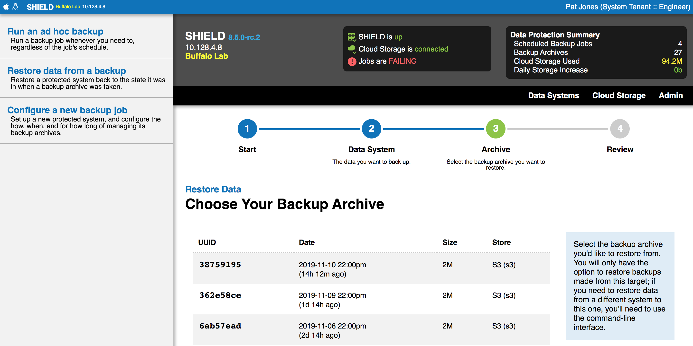

Shield is a data protection system that performs unattended and
automatic backup tasks, according to a schedule you define.

## Install the SHIELD CLI

The SHIELD project makes pre-compiled binaries available for
download on its [Github releases page][gh-cli].  Download the
correct binary for your platform, make it executable, and put it
somewhere in your `$PATH`.

[gh-cli]: https://github.com/starkandwayne/shield/releases


## Authenticate to SHIELD

To talk to SHIELD, you first have to _target_ a SHIELD Core.  The
SHIELD Core is the brains of a SHIELD installation; it handles the
scheduling and configuration of jobs, the execution of backup and
restore tasks, authentication, etc.

To target a SHIELD Core, use `shield api`:

```
$ shield api https://10.200.130.8 my-shield
my-shield  (https://10.200.130.8)  OK
SHIELD Buffalo Lab
```

(You can specify the alias and the URL in either order).

Once you've set up the target, you can activate it by passing the
`-c` option to all of your SHIELD commands, i.e.:

```
$ shield -c my-shield jobs
```

Or, you can set the `$SHIELD_CORE` environment variable:

```
$ export SHIELD_CORE=my-shield
$ shield jobs
```

Finally, in order to use the SHIELD Core, you'll need to
authenticate with credentials:

```
$ shield -c my-shield login
SHIELD Username: admin
SHIELD Password:
logged in successfully
```

The default credentials for SHIELD are `admin` (username) and
`shield` (password).  You should change these as soon as you can.

To check the status of SHIELD:

```
$ shield -c my-shield status
SHIELD Buffalo Lab v8.0.8
API Version 2

---[ MOTD ]-------------------------------------
Welcome to SHIELD!

------------------------------------------------
```

To log in via the web interface, just open the SHIELD Core URL in
your browser of choice, and enter your credentials:


## List Targeted SHIELD Cores

You can see what cores you have targeted using:

```
$ shield cores
Name       URL                   Verify TLS?
====       ===                   ===========
my-shield  https://10.200.130.8  yes
```

Each core will be listed, alongside the SHIELD URL (whatever was
given to `shield api`) and whether or not the `shield` CLI will
verify the TLS certificates that the SHIELD Core presents.


## Initialize a SHIELD

When SHIELD is first deployed, it has a blank Vault, and cannot do much of anything.  An operator must first _initialize_ the SHIELD,
selecting a master password in the process.

This master password will be used to encrypt the Vault
credentials.  SHIELD does not keep any record of this password.
You must save this password in an external location, and keep it
safe.

You can initialize a new SHIELD from the command-line via `shield
init`:

```
$ shield api https://10.200.130.8 my-shield
$ shield -c my-shield init
New SHIELD Core master password:
Confirm new master password:
SHIELD core unlocked successfully.
BELOW IS YOUR FIXED KEY FOR RECOVERING FIXED-KEY BACKUPS.
SAVE THIS IN A SECURE LOCATION.
----------------------------------------------------------------
02F63642CF3283CE826776A181D4DE6C18D9CD6ACF1C85052B0363FD93E85C67
F46971070951681DE62D1F9E240D247E254BC1787A4DE347B23416F6AEA39EEB
15CF4C3FDBEB2D7CEE54CA7D79789752B3458D0C4EBD3AF1B888605A52739002
E7D8B1B428FAD663EB74B385842C3A97122F979738281849C73A2E2DA39F2524
3C4F8AC2F8AFB04FC7F1E4CFD01CDFC607DB18529F5592AE5DEB6352F3B2EB14
9C4A2248FB2534DBB58DB7CC498282AD57766A0EF90302457352E35B2B38BD8F
C2CCAE48296508FA4DBFEBDFBD18A5C0389689F12650D17358B0BC4235A023F4
68C38A658AEC6C19C7AD58DFB6A62B68FD218D98B34C679129459DA51B9D8BC4
----------------------------------------------------------------
```

This _fixed key_ is necessary for backing up SHIELD itself.  Store
it somewhere safe, probably next to your master password.

If you prefer the web interface, all you need to do is log in.
Your first time logging into SHIELD will walk you through the process of initializing the core.


Enter your new master password, twice, and SHIELD will go
configure itself and unlock.  As with the CLI method, you will be
presented with a _fixed key_ that will be used for specific
backups (i.e. SHIELD itself).  You'll want to store that somewhere
safe and secure, outside the scope of the systems you are backing
up (don't put it in Vault!)


## My SHIELD is Locked!

When SHIELD reboots, its internal Vault also reboots, and comes up
sealed.  When this happens, SHIELD reports itself as "locked".
While locked, SHIELD will allow non-system users to login and
manage their jobs, pause and unpause them, change schedules, etc.
It will **not** run backup tasks, because it has no Vault to
generate encryption keys.

In contrast, system-level operators logging into the web
interface will be unable to do anything until they provide the
master password to unlock.


This can also be accomplished from the command-line:

```
$ shield unlock
SHIELD Core master password:
SHIELD core unlocked successfully.
```


## Change the SHIELD Master Password

If you believe your SHIELD master password has been compromised,
you can rekey the SHIELD Core to set a new one.  This will _not_
adversely affect previously taken backup archives; they will
continue to function, and can be restored at any time.

To rekey SHIELD via the command-line:

```
$ shield rekey
Current master password:
New SHIELD Core master password:
Confirm new master password:
SHIELD core rekeyed successfully.
```

This can also be accomplished in the web UI under `rekey SHIELD core` in the admin panel

The new master password will be required the next time SHIELD is
rebooted.


## What is a "tenant" / Why do I need one?

SHIELD has a robust access control system that allows several
teams to co-exist peacefully in one installation, without stepping
on each other's toes.  This is referred to as _multi-tenancy_.

Several of the "objects" that SHIELD manages, like job definitions
and target data system configurations, belong to a single tenant.

You can list the tenants you have access to on the command-line:

```
$ shield tenants
UUID                                  Name
====                                  ====
6f7643e2-77fd-448a-bb44-fb53d757a62d  tenant1
f3072633-4944-4423-b8b7-7e0be968521c  starkandwayne
1ab18dc3-714f-402e-9be0-d5343be5bed7  CF Community
```

To specify a specific tenant, i.e. to look for their jobs or
targets, you have to give the `shield` utility the `-t` or
`--tenant` option.  You can specify tenants either by name (easier)
or UUID (more accurate).  You can also set the `$SHIELD_TENANT`
environment variable.

In the web interface, you always operate inside of the context of
a single tenant, which you can change via the account menu in the
top right-hand corner:


## Configure a new Backup Job

To set up a new backup job, you need to know four things:

  1. What to backup (the _target_)
  2. When to backup (the _schedule_)
  3. Where to store the backup archives (the _store_)
  4. How long to keep the archives (the _retention policy_)

The SHIELD web user interface provides a guided wizard for
configuring a new backup job, which can be accessed from the
sidebar:


This is a three-stage wizard.  First, you'll configure your target
data system, the thing you want to back up.


The _Name_ is important; it's how you and other operators will
refer to the system, and how SHIELD will display the system on the
_Systems_ page.  Make it memorable, and unique.

_Notes_ are optional but highly encouraged.

The _Agent_ dropdown lists all the registered SHIELD Agents that
you can ask to perform the backup and restore tasks.  Usually,
this is the agent co-located on the data system, but it could be
an "external" agent if your backup plugin uses the network to
facilitate data exchange.

Once you select an agent, you'll need to select the plugin to use
for extracting data from the system, and then configure that
plugin:


Next, select where to keep the backup archives, or configure a new
storage system:


Next, you'll configure the schedule for your new backup job as well the retention of the archives created by this job:


Finally, review your new job details and click the save button.


## Execute a Backup Job Manually

SHIELD let's you kick off ad hoc backup job runs, either via the
command-line, or the web interface.  In either case, the scheduled
runs of the backup job are unperturbed.

From the web interface, you can click the _run_ link from the
job's details under the target view:


From the command-line, first get a list of jobs:

```
$ shield jobs
UUID                                  Name   Summary  Schedule       Status  Policy      SHIELD Agent       Target           Store       Fixed-Key
====                                  ====   =======  ========       ======  ======      ============       ======           =====       =========
691d2441-995b-48a4-ac03-fc188667bee6  Daily           daily at 3:00          Short-Term  10.200.130.8:5444  Important Files  Some Cloud  false
```

(Remember to set your tenant via `-t ...` or `SHIELD_TENANT=...`)

Then, trigger an ad hoc backup run:

```
$ shield run-job 691d2441-995b-48a4-ac03-fc188667bee6
Run job Daily in tenant starkandwayne? [y/N] y
Scheduled ad hoc backup job run
```


## Restore a Backup Archive

The SHIELD web interface has a guided wizard that takes you through the
steps of restoring a backup archive to a data system.  You can find it
linked from the sidebar:


This wizard will ask a few questions, to help you find the right system to
restore, and the correct archive to pull back and replay.  First, what do
you need to restore?


Next, SHIELD will show you all of the archives that have been made from this
target system, and gives a lot more prominence and visual weight to the most
recent one.



Finally, you get to a review screen, to make sure you are certain that you
want to perform this operation.  Remember: data restoration can be a
disruptive process.


You can also do this via the command-line.  First get a list of protected
data systems:

```
$ shield targets
UUID                                  Name             Plugin  SHIELD Agent       Configuration
====                                  ====             ======  ============       =============
4a642c3c-1f45-4c62-af03-f9120db4ed58  Important Files  fs      10.200.130.8:5444  {
                                                                                    "base_dir": "/var/vcap/store",
                                                                                    "include": "*.bak, ~"
                                                                                  }
```

(Remember to set your tenant via `-t ...` or `SHIELD_TENANT=...`)

Then, get the list of backup archives that exist for that target:

```
$ shield archives --target 'Important Files'
UUID                                  Key                                                                     Status
====                                  ===                                                                     ======
c2d0e613-31ca-42a9-80fe-55ce2f916ce1  demo/2018/03/28/2018-03-28-175905-0252eddd-977c-4aed-b2ec-3ad651807cd9  valid
```

Finally, do a SHIELD restore (using _your_ archive UUID):

```
$ shield restore-archive c2d0e613-31ca-42a9-80fe-55ce2f916ce1
```


## Set up new Cloud Storage

SHIELD uses Cloud Storage systems to store backups off-site.  You can
configure a wide variety of backend systems, including Amazon S3, Scality,
WebDAV, Google Cloud Storage, Azure Blobstore, and many more.

From the web interface, click on the _Configure a New Cloud Storage System_
link on the _Storage_ page:


You'll need to name your cloud storage, and can optional provide a more
detailed description that will be shown to SHIELD users.  The _threshold_ is
used for triggering alerts in the web interface header panel, when too much
of the storage budget has been used.

The _agent_ you select determines which storage plugins you can use, and how
to configure them.


## How Can I Share Storage Configuration Across Tenants?

Cloud Storage systems are normally private to a tenant.  If you are
site-level SHIELD administrator / operator, you can create _Global_ Cloud
Storage systems that will be made available to all tenants.  Most users will
not be able to view the configuration of this global storage, but will be
able to configure their backup jobs to use it.

You can create a global cloud storage system from the _SHIELD Admin
Backend_:


## View Backup Tasks

To view tasks for a single data system, access the _timeline view_ for that
system by clicking on its card on the _Systems_ page.


The timeline lists each task, in reverse chronological order, so the most
recently executed tasks float to the top.  Clicking on the task will expand
its task log:


This contains all of the relevant details about this task; when it was
scheduled, when it started, when it stopped, whether it succeeded or not,
etc.  It also contains a full log of what was done.


## Annotate a Backup Task

Sometimes, backups fail for reasons outside of your control.  Sometimes you
figure out why a string of failures occurred, and want to make notes.
SHIELD lets you do that via _task annotations_.

You can annotate a task for any reason.  Start by accessing the timeline
view for the system, and expand the task you want to annotate.  Then, click
the _Annotate_ button in the top right-hand corner:


This brings up the annotation form:


Fill in your notes, and then click _Save_.  Your new annotation will feature
prominently in the task header, without requiring anyone to expand the full
task log:


## What Agent Should I Use?

In general, if you co-locate an agent on the target data system that you
want to back up, that's the agent you should use.  These will often be named
after the BOSH deployment / instance\_group that they are deployed to, to
make things easier.

If you are unable to co-locate an agent, you can use _remote agents_, or
_external agents_, which run elsewhere, and use the network to perform
target-specific backup and recovery operations.  The data system has to
support this, as does the configuration of the data system.  For example,
PostgreSQL can handle a `pgdump` backup across the network, if you configure
the user permissions properly.  Redis, on the other hand, cannot do
network-based backup or restore.


## My SHIELD Agent Is Missing!

If you expect to see an agent in a dropdown in the web interface, but do
not, there's a few things you should check:

  1. Does the agent show up in the admin backend?
  2. Is the agent software running?
  3. Can SHIELD and the agent see each other on the network?

The _SHIELD Admin Backend_ provides a view into the list of registered
agents and their health:


If your agent is listed here, that means it is registering itself with the
SHIELD core properly.  If it is marked as unhealthy, investigate and resolve
that problem before returning to diagnostics with the SHIELD core.

If the agent is _not_ listed, double-check that:

  1. the `shield-agent` process on the remote host is running
  2. the agent is configured to talk to the right SHIELD core
  3. the agent whitelists the SHIELD core's public key

Finally, check your network topology.  SHIELD currently requires that it
have direct, mutual visibility with its agents.  The registration protocol
currently involves an HTTPS call into the core from the SHIELD agent.  The
core then uses the remote address that made said HTTPS call to _connect
back_ to the SHIELD agent to finish registration and interrogation.

This means that things like HTTPS proxies and NAT gateways can cause havoc
with SHIELD agent registration.
